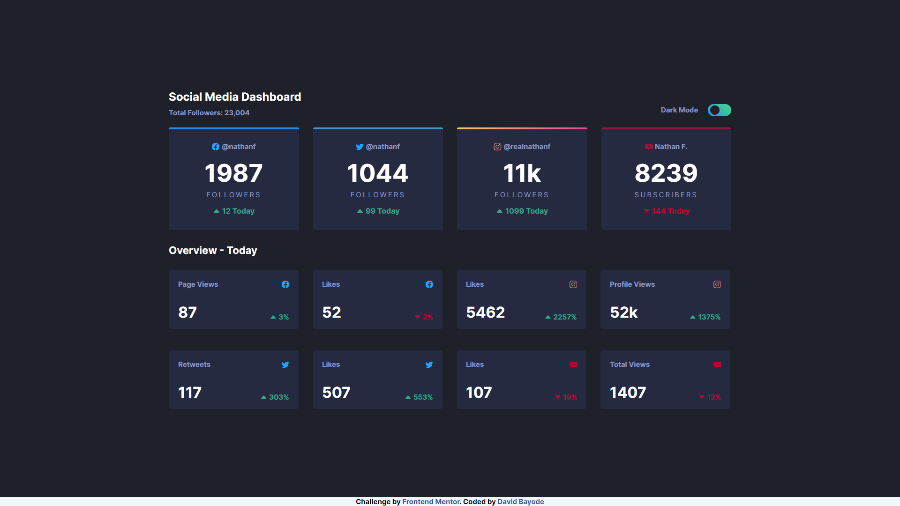

# Frontend Mentor - Social media dashboard with theme switcher solution

This is my solution to the [Social media dashboard with theme switcher challenge on Frontend Mentor](https://www.frontendmentor.io/challenges/social-media-dashboard-with-theme-switcher-6oY8ozp_H). Frontend Mentor challenges help you improve your coding skills by building realistic projects. 

## Table of contents

- [Overview](#overview)
  - [The challenge](#the-challenge)
  - [Screenshot](#screenshot)
  - [Links](#links)
- [My process](#my-process)
  - [Built with](#built-with)
  - [What I learned](#what-i-learned)
  - [Useful resources](#useful-resources)
- [Author](#author)
- [Acknowledgments](#acknowledgments)

## Overview

This is a very good challenge as I was faced with keeping track of elements as variable for the different color schemes of the project.

### The challenge

Users should be able to:

- View the optimal layout for the site depending on their device's screen size
- See hover states for all interactive elements on the page
- Toggle color theme to their preference

### Screenshot

### Links

- Solution URL: [GitHub Repo](https://github.com/David4bay/Frontend-Mentor-Social-Media-Component)
- Live Site URL: [Live URL](https://fluffy-narwhal-b42516.netlify.app)

## My process

I took the mobile-first approach using flexbox and then set a media query for screen sizes above 1200px.

### Built with

- Semantic HTML5 markup
- CSS custom properties
- Flexbox
- Mobile-first workflow

### What I learned

I learned more DOM manipulation methods in this project, as keeping track of DOM nodes is necessary if styling differently according to the themes' selected.

### Useful resources

- [Ese Alli Github](https://github.com/EseAlli/social-media-dashboard) - Her JavaScript solution was very useful in leading me to the right direction in making my own.

## Author

- Website - [My Blog](https://davidbay.hashnode.dev)
- Frontend Mentor - [@David4bay](https://www.frontendmentor.io/profile/David4bay)
- Twitter - [@Davidbay01](https://www.twitter.com/Davidbay01)

## Acknowledgments

[Ese Alli's](https://github.com/EseAlli) JavaScript implementation was very useful in setting DOM node themes.